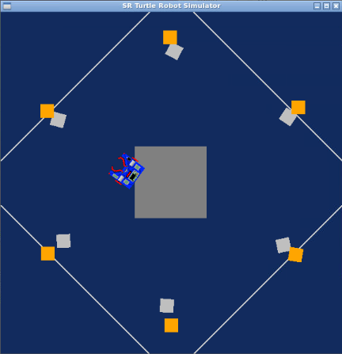
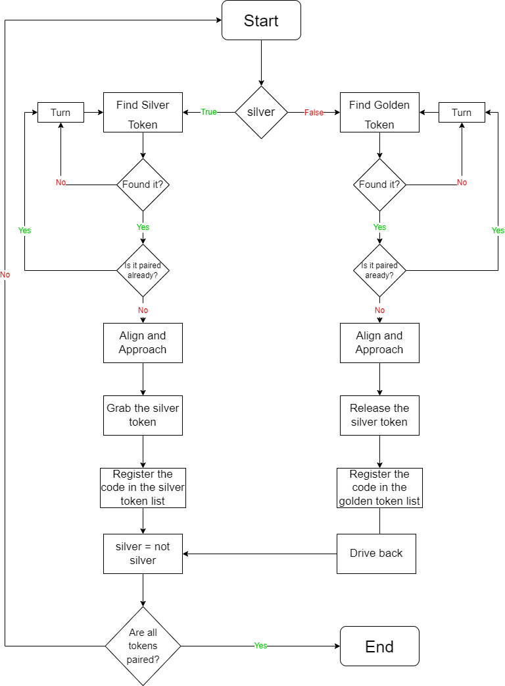

# ResearchTrack_Assignment1

Student: Matteo Cappellini (4822622)

Goal of the assignment
---------------------------

The goal of this assignment is to write a python code such that the robot will firstly search for a silver token in the enviroment, grab it and then put it near a golden one, such that at the end we will see every silver token paired to a golden one, as follows:

Running the code
---------------------------

The simulator requires a Python 2.7 installation, the [pygame](http://pygame.org/) library, [PyPyBox2D](https://pypi.python.org/pypi/pypybox2d/2.1-r331), and [PyYAML](https://pypi.python.org/pypi/PyYAML/).

Once the dependencies are installed, simply run the `assignment1.py` script to test out the simulator by writing the following line in the terminal: `python2 run.py assigment1.py`.

Flowchart
---------------------------

The code that I wrote uses one while loop that keeps iterating until all six golden tokens are paired to every silver one, to differentiate between silver and golden tokens I used the boolean variable "silver" that changes its value based on the token I want the robot to search for.
The robot will turn until it finds a silver token that isn't already paired, align with it, approach it, grab it and then move it until it reaches an unpaired golden token and releases the silver box next to it; this process will be repeated until each silver token is paired with a golden one, as described in the following flowchart:

Possible improvements
---------------------------

To make the code as general as possible we could adapt it with the porpouse of making it able to detect the other tokens in its way, after grabbing a silver token, and make it able to avoid them by changing direction. We could also improve the code by giving it the ability to detect the total number of token in the arena and making the robot stop only after pairing each one of them, instead of making it stop after paring the twelve tokens present in this assignment.
